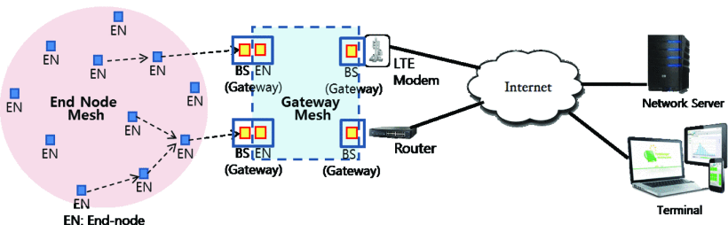

# MeshCom 
is a tactical mesh-network for messaging and telemetry data using LoRa Chirp Modulation. There is no hierarchy in a mesh network topology, every node can relay a packet and cooperate with other nodes to efficiently route a packet to the gateways. Mesh networks dynamically connect end-nodes together and self-configure the routing paths.

The Meshcom network is self-configured using flooding algorithms. In flood-based networking a node broadcasts a beacon message. The neighbouring nodes receive the message and relay it with a reception history. When the flooding process ends, most of the end-nodes would have received the beacon message several times either directly from a gateway or through other end-nodes. Thereafter, a mesh table is availaable in each end-node and in the gateways based on the reception history and received signal strength indication (RSSI) of the beacon message.

Following are the characteristics of the MeshCom network:
<ul>
<li>There is no need for cell-planning with the gateways, and the end-nodes can be deployed in a relatively simple and flexible manner.</li>

<li>The routing paths are established automatically among the end-nodes. If there is a failure in the existing routing path, re-routing is done in the network, and new paths are reconfigured.</li>

  <li>The network is optimized for low-rate communication at sub-GHz bands.</li>

  <li>N:1 and 1:N bidirectional communications are possible.</li>

  <li>The network is suitable for messaging, telentric data and ad-hoc communication</li>
</ul>